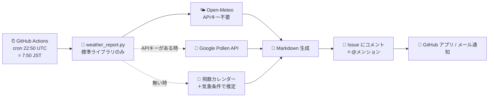

# 毎朝の天気通知

毎朝 8 時ごろ、GitHub Issue に当日の天気・気温・体感気温・湿度・降水確率・降水量・風・花粉・推奨服装を通知します。GitHub Actions で動くので、PC を起動しておく必要はありません。

## 仕組み



## 通知に含まれる項目

| 区分 | 内容 |
| --- | --- |
| 概況 | 天気、最高/最低気温、最高/最低体感気温、平均湿度、最大降水確率、降水量、風向・風速・瞬間風速 |
| 時間別 | 6・9・12・15・18・21 時の天気/気温/体感/湿度/降水確率/風 |
| 花粉 | スギ・ヒノキ・ブタクサ・イネ科の 5 段階レベル |
| 服装 | 体感気温に応じた服装の目安＋傘・日較差・強風・熱中症などの注意 |

## セットアップ

リポジトリに push するだけで動きます。追加の設定は不要です。

初回実行時に `daily-weather` ラベルの付いた Issue が 1 つ自動で作られ、以降はその Issue に毎朝コメントが追加されます。コメント冒頭でリポジトリオーナーをメンションするため、GitHub アプリまたはメールに通知が届きます。

### 地点を変える

`config.json` の `location` を編集するか、リポジトリの Variables に設定します（Variables が優先）。

| Variable | 例 |
| --- | --- |
| `WEATHER_LATITUDE` | `34.6937` |
| `WEATHER_LONGITUDE` | `135.5023` |
| `WEATHER_LOCATION_NAME` | `大阪市` |

### 通知先のメンション先を変える

Variables に `NOTIFY_MENTION` を設定します（既定はリポジトリオーナー）。

### 花粉を実データにする

既定では**推定値**です。実データにするには [Google Pollen API](https://developers.google.com/maps/documentation/pollen) のキーを取得し、リポジトリの Secrets に `GOOGLE_POLLEN_API_KEY` として登録してください。1 日 1 回の実行なら月 30 回程度で、無料利用枠に収まります。

## 花粉データについて（重要）

日本のスギ・ヒノキ花粉を無料で取得できる公的 API は、現在ありません。

- 環境省花粉観測システム「はなこさん」は **令和 3 年度（2021 年度）で事業廃止**。民間気象会社の観測点が全国に整備されたことが理由です（[環境省 報道発表](https://www.env.go.jp/press/110339.html)）。
- Open-Meteo の花粉データは CAMS ヨーロッパ大気質モデル由来で **欧州限定**。日本では値が返りません。またスギ・ヒノキに相当する変数自体がありません。
- 日本気象協会（tenki.jp）などの予測データは**有償提供**です。

そのため本リポジトリでは次の 2 段構えにしています。

1. `GOOGLE_POLLEN_API_KEY` がある → **Google Pollen API の実データ**。日本ではスギ（`JAPANESE_CEDAR`）・ヒノキ（`JAPANESE_CYPRESS`）に対応しています。
2. キーが無い / 取得に失敗 → **推定値**にフォールバックし、通知本文に「実測ではない」と明記します。

推定は、関東の一般的な飛散カレンダーを半月単位で数値化したものに、「気温が高い・湿度が低い・風が強い・雨が降らない日ほど飛びやすい」という経験則を気象係数として掛けた簡易スコアです。実測値でも公的予報でもありません。

## 通知時刻について

cron は `50 22 * * *`（UTC）＝ 7:50 JST に設定しています。GitHub Actions のスケジュール実行は毎時 00 分に負荷が集中して数分〜十数分遅れることがあるため、少し前倒しで起動しています。届く時刻は 8 時前後で、分単位の正確さは保証されません。

## ローカルで試す

```bash
python3 scripts/weather_report.py            # 標準出力にレポートを表示
python3 scripts/test_weather_report.py       # ネットワーク不要のロジックテスト
```

GitHub 上では「Actions」タブから `毎朝の天気通知` を選び、`Run workflow` で手動実行できます。`dry_run` を有効にすると Issue に投稿せず、ジョブサマリーで内容だけ確認できます。

## データ源

- 天気: [Open-Meteo](https://open-meteo.com/) — 非商用利用は無料、APIキー不要
- 花粉: [Google Pollen API](https://developers.google.com/maps/documentation/pollen)（任意）
